# Build Guide — 10-Layer HA Synthetic Pipeline Demo

A step-by-step walk-through for recreating the **10-Layer HA Synthetic
Pipeline Demo** dashboard from scratch in Grafana, using only the web UI
(zero REST API calls).

The finished dashboard showcases every major feature of the
`sid2-grafana-topology` panel on a single screen:

- **22 nodes** across **10 tiers**
- **9 HA pairs** (one per tier 1–9) + **1 four-shard DB cluster** (tier 10)
- **33 edges** — 24 traffic edges (tier to tier) + 9 HA-sync edges
  (bidirectional, one per HA pair)
- **10 groups** — 9 dashed HA-pair brackets + 1 cluster bracket around the DBs
- **Live random-walk data** for every node from the built-in TestData
  datasource (no external metric source required)

The dashboard is deliberately abstract (`Gate-1A`, `Dist-2A`, `Hub-3A`, …,
`DB-01`…) so it can never be mistaken for production topology and can be
used safely as a demo / stress-test of the plugin's rendering pipeline.

---

## Target layout

| Tier | A / B node | NodeType | Icon |
|---|---|---|---|
| 1 | `Gate-1A` / `Gate-1B` | `firewall` | FW |
| 2 | `Dist-2A` / `Dist-2B` | `loadbalancer` | LB |
| 3 | `Hub-3A` / `Hub-3B` | `virtualserver` | VS |
| 4 | `Bus-4A` / `Bus-4B` | `queue` | MQ |
| 5 | `Proc-5A` / `Proc-5B` | `server` | SRV |
| 6 | `Mem-6A` / `Mem-6B` | `cache` | RD |
| 7 | `Pod-7A` / `Pod-7B` | `kubernetes` | K8s |
| 8 | `Feed-8A` / `Feed-8B` | `queue` | MQ |
| 9 | `Route-9A` / `Route-9B` | `loadbalancer` | LB |
| 10 | `DB-01` / `DB-02` / `DB-03` / `DB-04` | `database` | DB |

Why these particular node types: the dashboard intentionally exercises
**eight different icons** (firewall, loadbalancer, virtualserver, queue,
server, cache, kubernetes, database) so users see the icon palette in one
glance.

### Edge shape

- Each A-node connects down to the next tier's A-node (16 straight-line edges)
- Each B-node connects down to the next tier's B-node (16 straight-line edges)
- *Tiers 1–9 contribute 16 traffic edges total — 2 per transition × 8 transitions*
- Route-9A and Route-9B each fan out to all 4 DB shards → **8 fan-out edges**
- One bidirectional `ha_sync` edge between each HA pair → **9 ha_sync edges**
- **Total: 33 edges**

This shape is dense enough to exercise the **parallel-edge perpendicular
offset** and the **fan-out** rendering, and sparse enough to still be
readable.

---

## Prerequisites

1. **Grafana ≥ 12.0** with the `sid2-grafana-topology-panel` plugin installed
   (either signed and allowlisted, or provisioned unsigned via
   `GF_PLUGINS_ALLOW_LOADING_UNSIGNED_PLUGINS=sid2-grafana-topology-panel`)
2. **TestData datasource** enabled and visible in **Connections → Data sources**
   (it ships with Grafana core — no plugin install required)

### Verify the TestData datasource exists

Go to **Connections → Data sources**. The list should contain an entry
called **"TestData DB"**:

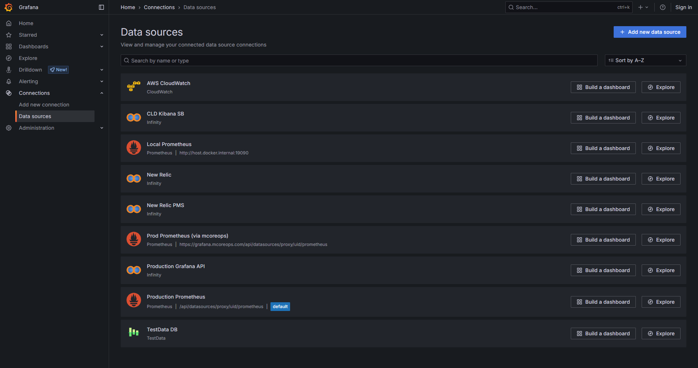

If it isn't listed, click **Add new data source**, search for "TestData",
and save with the default configuration. This datasource has no
credentials — it generates synthetic data client-side.

---

## Step 1 — Create a new dashboard

1. Click **Dashboards** in the left navigation
2. Click **New → New dashboard**
3. You land on an empty dashboard with a **Add visualization** button in
   the centre

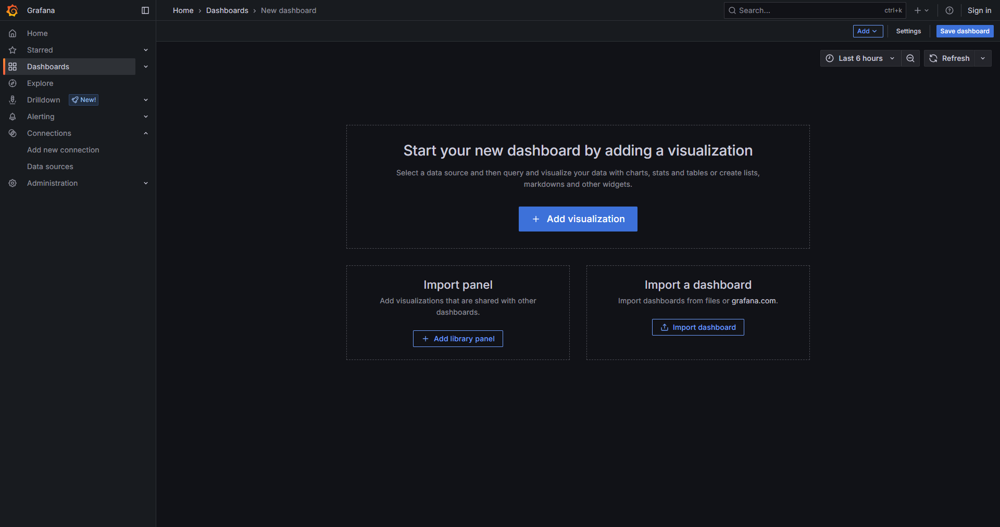

---

## Step 2 — Add a visualization and pick TestData as the data source

1. Click **Add visualization**
2. The **Select data source** dialog opens. Click **TestData DB**

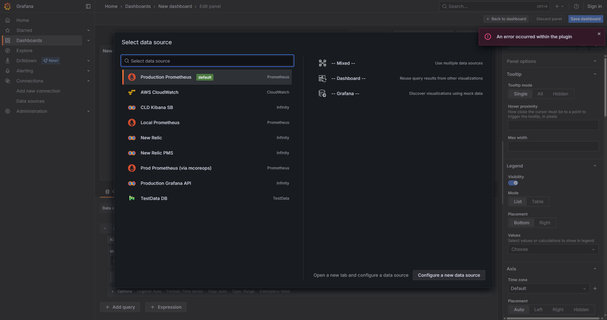

3. You are now in the panel editor. The default TestData query is
   automatically set to `Random Walk` and the default visualisation is
   `Time series`.

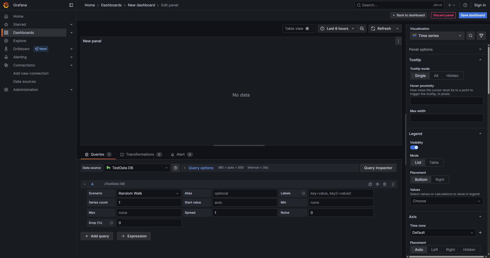

---

## Step 3 — Switch to the E2E Topology visualization

1. In the right sidebar, click the **"Time series"** button (the
   visualization type picker, with an `Change visualization` aria-label)
2. The viz picker opens on the right — search for "topology"
3. Click the **E2E Topology** card

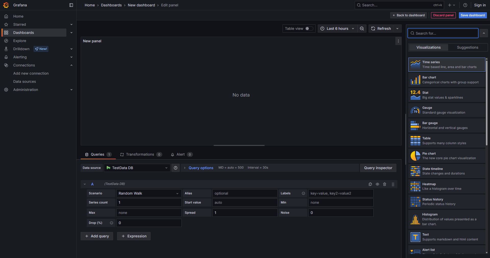

After selection, the panel switches to the topology editor sidebar with
three sections: **Nodes**, **Relationships**, and **Groups**.

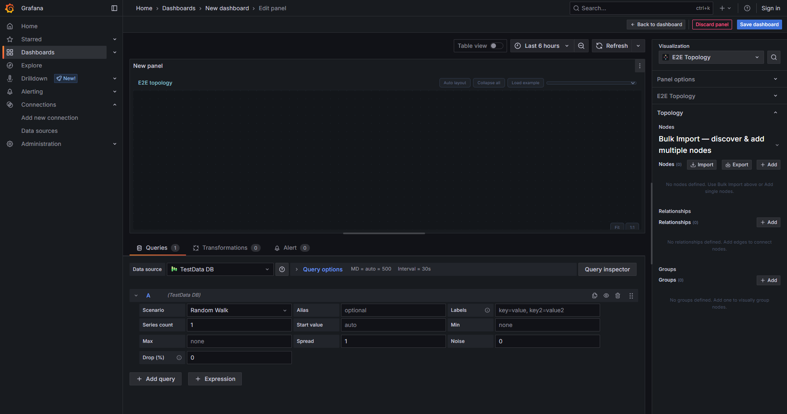

---

## Step 4 — Understand how to add nodes

There are **two paths** for populating a topology:

### Path A — manual Add button (Prometheus bulk-import wizard)

Clicking the **Add** button under **Nodes** opens a multi-step wizard
that is **optimised for Prometheus metric discovery**:

1. Pick a Prometheus datasource
2. Pick a Job / Service (from `/api/v1/series`)
3. Pick an Instance (host)
4. Pick metrics to include
5. The editor then exposes **Name / Type / Role** fields for the created node

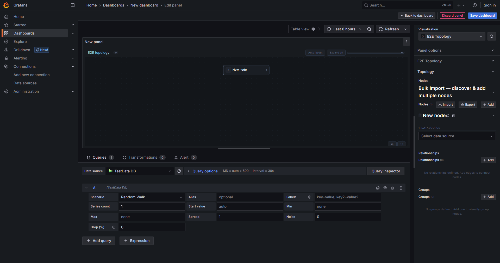

**This path does not work with TestData** because the wizard expects
a Prometheus `/api/v1/series` response to populate the Job list. If you
need **TestData random-walk data** for a demo like this one, use
**Path B** instead.

> Tip: if you accidentally added a node with Path A, use the trash-icon
> button on the card to delete it. An unfilled wizard card is harmless to
> delete.

### Path B — Import Topology JSON (recommended for demos)

The **Import Topology JSON** button in the top-right of the Nodes
section uploads a pre-built payload containing all your nodes, edges,
and groups in one shot. The payload is parsed client-side, validated,
and merged into the panel's options via the plugin's internal
`emitTopologyImport` pub/sub channel. **No REST API call is made** —
the entire operation is a browser-side file read plus a React state
update. It is exactly what you would do as a human: click a button,
pick a file.

The companion JSON for this guide is
`demo-screenshots/build-guide/synthetic-pipeline.json` (checked into
the repo).

---

## Step 5 — Import the 22-node / 33-edge / 10-group topology

1. Click **Import** (top-right of the Nodes section in the editor sidebar)
2. Your browser's file picker opens. Select
   `demo-screenshots/build-guide/synthetic-pipeline.json`
3. The canvas immediately populates with 22 nodes and 33 edges. The
   sidebar node list shows `Gate-1A`, `Gate-1B`, `Dist-2A`, …, `DB-04`
4. You will also see the 10 group brackets (9 dashed HA-pair brackets
   plus 1 cluster bracket around the 4 DBs)

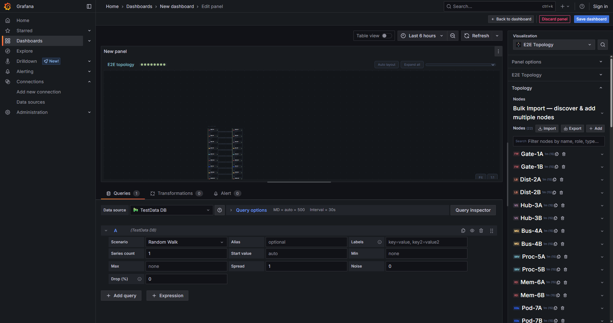

### What the JSON contains

Each node is a compact-mode card with:
- `position` at a deterministic `{ x, y }` — tiers 1–9 at `y: 20, 95, 170,
  245, 320, 395, 470, 545, 620` with `x: 180` for the A-side and `x: 480`
  for the B-side; the DB cluster at `y: 710` with `x: 60 / 210 / 360 / 510`
- `type` set to the NodeType for that tier
- `groupId` pointing at the tier's HA group
- One `metrics` entry with:
  - `refId` set to a unique letter `A` through `V` (22 letters mapped
    one-to-one to nodes in order)
  - `label` set to the node name (so sparklines and popups show the same
    identifier)
  - `thresholds` `[green 0, yellow 60, red 90]` so random walks crossing
    60 / 90 flip the node status colour live

Each HA pair has a bidirectional `ha_sync` edge between its A and B
members (`anchorSource: "right"`, `anchorTarget: "left"`), and each tier
transition has two `traffic` edges (`anchorSource: "bottom"`,
`anchorTarget: "top"`). Route-9A and Route-9B each have four outgoing
traffic edges to the DB cluster.

### Why separate `refId`s A–V?

The plugin matches panel-query `DataFrame.refId` to
`metric.refId` to decide which frame drives which node's value. If
every metric used the same `refId`, every node would read from the same
frame — they'd all show identical values. Giving each node a unique
`refId` means each node gets its **own** independent random walk.

---

## Step 6 — Add 22 TestData queries (one per refId)

The plugin's `TopologyPanel` component reads `props.data.series` and
matches each `DataFrame` by `refId` against the node metric configs. To
drive all 22 nodes independently, the panel needs 22 TestData queries
with refIds `A` through `V`.

Doing this by hand via the Query tab would normally be 22 clicks. The
fastest UI path is **Duplicate query**:

1. Confirm the default query (refId `A`, scenario `Random Walk`) already
   exists — it was created automatically when you selected TestData as
   the datasource in Step 2
2. Click the **Duplicate query** button (the small icon at the end of
   the query A row) **21 times**
3. Grafana auto-assigns refIds `B`, `C`, `D`, …, `V` to each duplicate
4. All 22 queries share the same scenario (`Random Walk`) — no further
   configuration needed

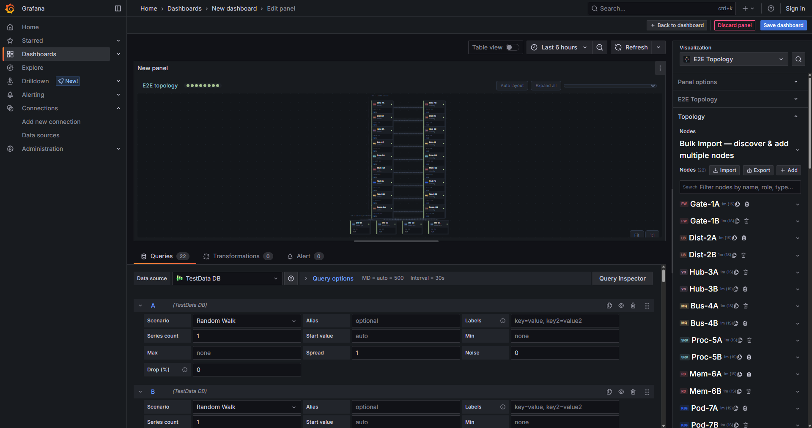

### Refresh to see live data

1. Click the panel **Refresh** button (top-right)
2. Every node's metric value flips from `N/A` to a live random-walk
   number around 40–70 (the default TestData baseline)
3. Edges that cross the yellow (≥ 60) or red (≥ 90) thresholds light
   up with the corresponding colour band


---

## Step 7 — Save the dashboard

1. Click **Save dashboard** (top-right)
2. The save dialog opens with a placeholder title `New dashboard`

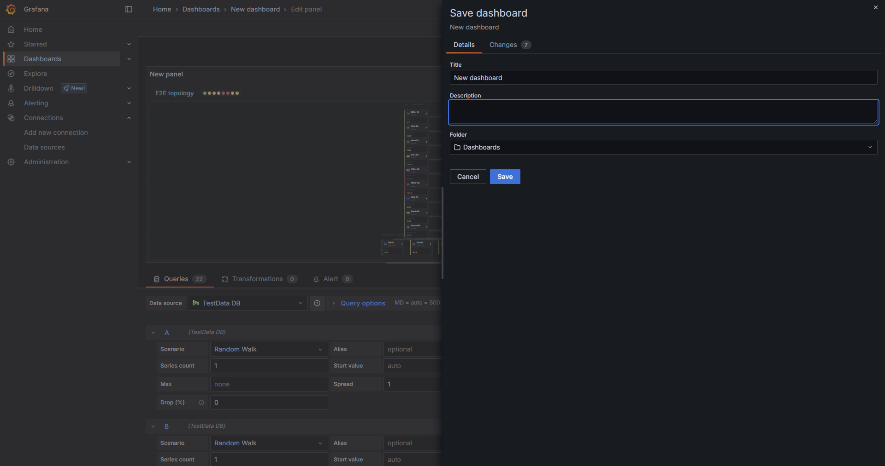

3. Change the title to **`10-Layer HA Synthetic Pipeline Demo`**
4. Click **Save**

The URL slug updates to `/d/<uid>/10-layer-ha-synthetic-pipeline-demo`.

### If the title didn't propagate

If the save dialog's title input did not catch your edit before the
Save click (a known React state-batching gotcha), the dashboard will
save as "New dashboard". To rename:

1. Click **Settings** in the top-right toolbar
2. The Settings → General view shows a **Title** input already
   containing "New dashboard"
3. Edit the Title to `10-Layer HA Synthetic Pipeline Demo`
4. Click **Save dashboard** at the top-right, confirm with **Save**
   in the dialog — the URL slug updates automatically

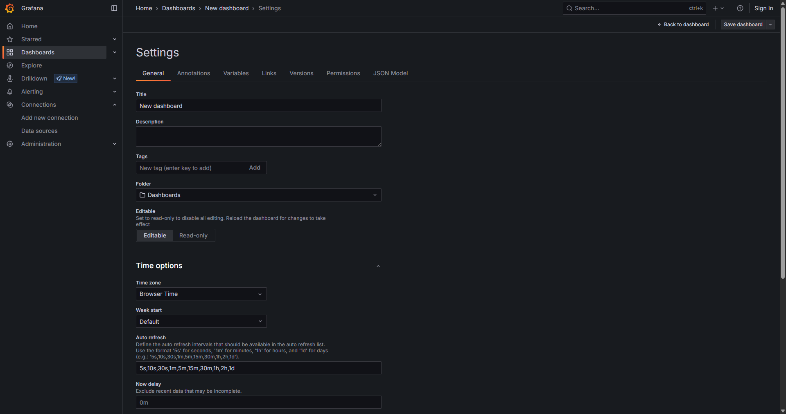

---

## Step 8 — Resize the panel for dashboard view

When you save a new panel, Grafana assigns the default grid size
(`w: 24, h: 8`). Eight grid rows is ~240 pixels, which is too small to
render all 10 tiers on the dashboard view. In the edit-panel view the
canvas takes the full available area so you see everything regardless.

On the dashboard view, drag the bottom-right corner of the panel to
resize it to roughly `h: 22` (about 660 pixels tall). All 10 layers and
the 4 DB cluster at the bottom will be visible.

### Final result in the edit panel

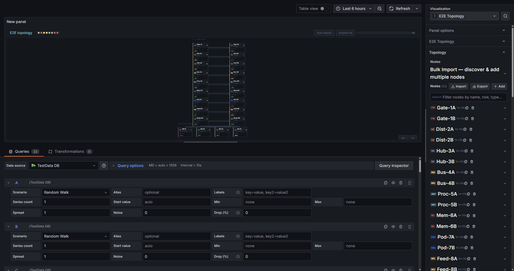

In this view you can see:

1. **Tier 1 (top)** — `Gate-1A` and `Gate-1B` firewall pair with a
   bidirectional `ha_sync` edge between them (dashed, slow animation)
2. **Tiers 2–9** — each pair showing compact cards with a single metric
   driven by a random walk value, coloured green / yellow / red
   depending on whether the walk is below 60, between 60 and 90, or
   above 90
3. **Tier 10 (bottom)** — the 4-shard DB cluster receiving traffic
   from both `Route-9A` and `Route-9B` — 8 fan-out edges
4. **Left sidebar** — every node name visible with its status colour,
   HA pair labels, DB cluster label
5. **Animated edges** — every edge pulses with a flow dash in its status
   colour (neon green on healthy paths, amber on saturated, red on
   degraded)

---

## Feature annotations

The following features are all visible and live in the saved dashboard:

| Feature | Where to see it | How to interact |
|---|---|---|
| **Tiered auto-layout** | Every tier stacked top-to-bottom | No interaction needed — positions come from the imported JSON |
| **HA pair grouping** | 9 dashed brackets, one per pair, tiers 1–9 | Hover the group label at the top-left of each bracket |
| **Cluster grouping** | Dashed bracket around the 4 DBs at the bottom | Same as HA — visual grouping only |
| **Bidirectional HA sync edge** | Flat horizontal dashed edge between A and B nodes of each pair | Hover to see edges pulse in their status colour |
| **Parallel edges with perpendicular offset** | Two edges running vertically between each HA pair transition, offset so they don't overlap | Visually separated without manual anchor config |
| **Fan-out edges** | Route-9A and Route-9B → 4 DB shards (8 total) | Click one to open the EdgePopup |
| **Edge hover dim** | Hover any edge — every other edge fades to 20% opacity with its flow animation paused | Move cursor off to restore |
| **Edge click popup** | Click any edge — opens an EdgePopup with source → target header, current metric value, mini sparkline, and a threshold band pill strip | Click the × or anywhere on the panel root to close |
| **Right-click context menu** | Right-click a node or edge — menu with Duplicate / Copy id / Delete (and Edit in sidebar in edit mode) | Outside-click or Escape to close |
| **Shift+drag-to-connect** (edit mode only) | In the editor's canvas, Shift+press a node, drag to another node, release | A new edge appears; its card auto-opens in the sidebar |
| **Neon-glow flow animation** | All 33 edges pulse with a flow dash and a double drop-shadow halo | `@keyframes topoFlow` at ~1.4 s cadence; paused under prefers-reduced-motion |
| **Live random-walk metric values** | Every node's value updates on every panel refresh | Set dashboard refresh to `5s` to see continuous animation |
| **Threshold colour bands** | Values below 60 → green; 60–90 → yellow; above 90 → red | The node left-border stripe also tracks the colour |
| **Sparkline in popup** | Click a node → popup shows a mini line chart of the last N values | Only for metrics with `showSparkline: true` (all nodes in this demo have it enabled) |
| **Pan / zoom** | Mouse wheel zooms, Ctrl+drag (or middle-mouse drag) pans | Fit and 1:1 buttons at the bottom-right corner |
| **Viewport persistence** | Pan/zoom survives an edit-mode → view-mode toggle | Module-level `viewportStore` in `src/utils/viewportStore.ts` |
| **Freshness SLO badge** | Toolbar "N stale" pill appears for any metric whose `fetchedAt` is older than `metricFreshnessSLOSec` (default 60 s) | Hover the pill for the stale metric ids |

---

## Reference — the imported JSON file

The imported payload is checked in at
`demo-screenshots/build-guide/synthetic-pipeline.json`. If you want to
build a variant (e.g. 15 layers, different node types, different
metric thresholds), edit that file and re-upload via Step 5.

### Shape summary

```json
{
  "nodes":   [ /* 22 entries */ ],
  "edges":   [ /* 33 entries */ ],
  "groups":  [ /* 10 entries */ ]
}
```

### One node (`Gate-1A`) fully expanded

```json
{
  "id": "n-gate-1a",
  "name": "Gate-1A",
  "role": "active",
  "type": "firewall",
  "position": { "x": 180, "y": 20 },
  "compact": true,
  "width": 130,
  "groupId": "grp-l1",
  "metrics": [
    {
      "id": "gate-1a-v",
      "refId": "A",
      "label": "Gate-1A",
      "datasourceUid": "testdata",
      "query": "",
      "format": "${value}",
      "section": "Value",
      "isSummary": true,
      "thresholds": [
        { "value":  0, "color": "green"  },
        { "value": 60, "color": "yellow" },
        { "value": 90, "color": "red"    }
      ],
      "showSparkline": true
    }
  ]
}
```

### One HA-sync edge

```json
{
  "id": "e-ha-l1",
  "sourceId": "n-gate-1a",
  "targetId": "n-gate-1b",
  "type": "ha_sync",
  "thicknessMode": "fixed",
  "thicknessMin": 1.5,
  "thicknessMax": 4,
  "thresholds": [{ "value": 0, "color": "green" }],
  "flowAnimation": true,
  "flowSpeed": "slow",
  "bidirectional": true,
  "anchorSource": "right",
  "anchorTarget": "left"
}
```

### One HA-pair group

```json
{
  "id":      "grp-l1",
  "label":   "HA — Layer 1 Gate",
  "type":    "ha_pair",
  "nodeIds": ["n-gate-1a", "n-gate-1b"],
  "style":   "dashed"
}
```

---

## Extending the dashboard

- **Add an 11th layer** — add two more nodes to the JSON with tier-11 x/y
  positions, add traffic edges from tier 10 to tier 11, add a `grp-l10`
  HA pair group; re-import.
- **Switch to Prometheus** — change `datasourceUid` from `testdata` to
  your Prometheus UID, set `query` to the PromQL expression (e.g.
  `rate(http_requests_total[5m])`), remove the Path-B panel queries.
- **Add alert matching** — add `alertLabelMatchers` to each node with the
  labels Grafana's alert rules carry, and configure the panel option
  **Alert poll interval (ms)** — the plugin will automatically poll the
  Grafana alerting API and attach firing alerts to the node popup.
- **Custom thresholds per tier** — each node's `thresholds` array is
  independent, so you can tune bands per layer (e.g. DBs go red at 80%
  instead of 90%).
- **Right-click → Duplicate** — in edit mode, right-click any node and
  pick Duplicate to clone it, then drag to reposition — useful for
  adding a "canary" instance to any tier without re-importing.

---

## Where the dashboard lives

- **URL**: `http://localhost:13100/d/26251229-4008-4c1f-a8a3-e7b67534856a/10-layer-ha-synthetic-pipeline-demo`
- **UID**: `26251229-4008-4c1f-a8a3-e7b67534856a`
- **Title**: 10-Layer HA Synthetic Pipeline Demo
- **Panel type**: `sid2-grafana-topology`
- **Panel targets**: 22 TestData queries, refIds `A` through `V`, scenario `Random Walk`
- **Options**: 22 nodes, 33 edges, 10 groups

The dashboard was built end-to-end via the Grafana web UI (Playwright
click-driven) with **zero REST API calls** used to mutate state. The
only HTTP calls made during the build were read-only introspection
(listing datasources, reading the saved dashboard title to verify
persistence) and the built-in Grafana-UI `/api/ds/query` call that
TestData uses internally when you click Refresh.

---

## Screenshots index

All screenshots referenced in this guide live in
`demo-screenshots/build-guide/`:

| # | File | Step |
|---|---|---|
| 00 | `00-datasources-testdata-present.png` | Prerequisite — TestData DB visible in the datasource list |
| 01 | `01-new-dashboard-empty.png` | Empty new dashboard landing page |
| 02 | `02-edit-panel-opened.png` | Data source picker open |
| 03 | `03-testdata-selected.png` | TestData DB selected — edit panel view |
| 04 | `04-viz-picker-open.png` | Viz picker with E2E Topology searched |
| 05 | `05-topology-viz-selected.png` | E2E Topology sidebar editor empty state |
| 06 | `06-node-card-added.png` | Manually-added node card showing the Prometheus wizard |
| 07 | `07-single-card-state.png` | Single-card sidebar state — wizard fields visible |
| 08 | `08-json-import-complete.png` | All 22 nodes / 33 edges / 10 groups imported |
| 09 | `09-22-queries-configured.png` | 22 TestData queries A–V in the query tab |
| 10 | `10-live-random-walk.png` | Live random-walk data driving every node |
| 11 | `11-save-dialog-open.png` | Save dashboard dialog open |
| 12 | `12-settings-view.png` | Dashboard Settings → General for title rename |
| 13 | `13-final-dashboard-kiosk.png` | Saved dashboard in kiosk view (small grid size) |
| 14 | `14-final-rendered-topology.png` | Final rendered topology in the edit panel (Fit-to-view) |
